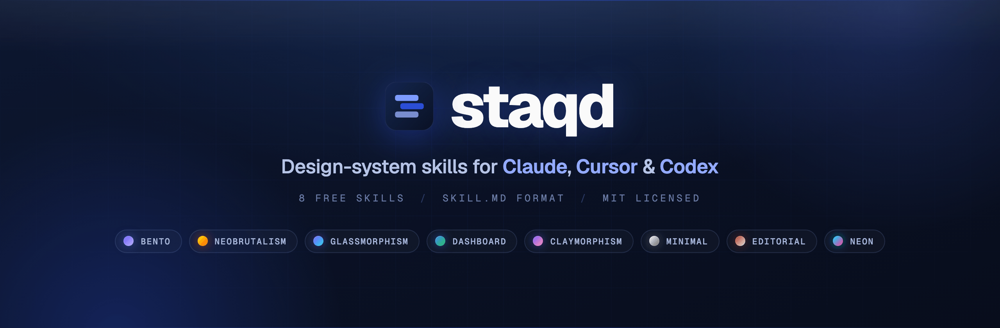

  

  &nbsp;
  &nbsp;
  &nbsp;
  &nbsp;
  

  <b>Installable, framework-agnostic design-system skills for AI coding agents.</b> 
  Each skill is a single <code>SKILL.md</code> that teaches your agent a complete visual language — color, type, layout, components, motion &amp; accessibility — so the UI it generates looks deliberate, not generic.

These are the **8 free skills** from [**staqd**](https://staqd.ai). The full library is **67 skills** across aesthetics, layouts, tones, and themes — browse them all (with live, hosted UI demos) at **[staqd.ai/skills](https://staqd.ai/skills)**.

## Skills in this repo

| Slug | Skill | What it is |
|---|---|---|
| [`bento`](skills/bento/SKILL.md) | **Bento** | A modular grid of card-like blocks with clear hierarchy and soft spacing that makes any content feel organized, scannable, and modern. |
| [`neobrutalism`](skills/neobrutalism/SKILL.md) | **Neobrutalism** | A loud, high-contrast look built from chunky shapes, hard black edges, and unapologetically blocky color that refuses to whisper. |
| [`glassmorphism`](skills/glassmorphism/SKILL.md) | **Glassmorphism** | Translucent frosted panels that float over colorful depth, blurring the layer beneath into soft luminous glass. |
| [`dashboard`](skills/dashboard/SKILL.md) | **Dashboard** | A cloud-platform aesthetic of modular grids, glass-like panels, and crisp data hierarchy built for productivity dashboards that need to feel calm under heavy information. |
| [`claymorphism`](skills/claymorphism/SKILL.md) | **Claymorphism** | Soft, puffy surfaces molded from light and shadow—rounded, tactile, and playful, like pressing buttons made of pastel clay. |
| [`minimal`](skills/minimal/SKILL.md) | **Minimal** | A stripped-down system that removes every ounce of noise so content and core function are all that remain. |
| [`editorial`](skills/editorial/SKILL.md) | **Editorial** | A magazine-grade design system that makes typography the hero, pairing structured grids with generous whitespace and confident headlines. |
| [`neon`](skills/neon/SKILL.md) | **Neon** | A dark-mode-first system built on glowing borders, fluorescent accents, and high-contrast cyberpunk energy. |

## How to use

1. Pick a skill and open its `SKILL.md`.
2. Install it into your agent (see **Install** in each skill), or just paste the contents into your prompt.
3. Ask for the component or screen you need — the agent applies the aesthetic.

### Install (any skill)

- **Claude Code** — copy `skills/<name>/SKILL.md` to `.claude/skills/<name>/SKILL.md` (project) or `~/.claude/skills/` (personal). The agent auto-discovers it by its `description`.
- **Cursor** — paste the contents into `.cursor/rules/<name>.mdc`.
- **Codex / other agents** — paste into `AGENTS.md` or your system prompt.

## The full library

This repo is the free starter set. The complete **67-skill** library — including layout systems (bento, dashboard, editorial), aesthetics (glass, clay, neon, neobrutalism), and many more, each with a **real hosted UI demo** — is at **[staqd.ai](https://staqd.ai)**.

## License

[MIT](LICENSE) © staqd. Use them in anything, commercial or not.

## Contributing

Found a bug in a skill, or want to suggest an improvement? Open an issue or PR. (New aesthetics ship through [staqd.ai](https://staqd.ai) first.)
